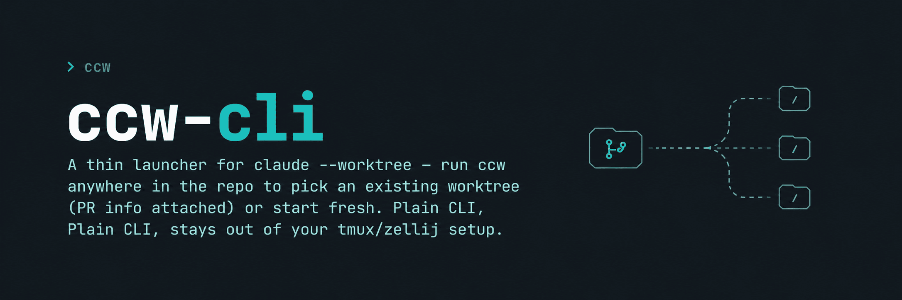

<div align="center">



**[Claude Code](https://docs.claude.com/claude-code) 標準の `--worktree` を薄くラップするランチャー — リポジトリのどこからでも `ccw` と打てば、既存の worktree を PR 情報付きで選択・起動できます（無ければ新規作成）。単体 CLI なので tmux/zellij と競合しません。**

[](../go.mod)
[](https://github.com/tqer39/ccw-cli/releases)
[](../LICENSE)
[](https://github.com/tqer39/homebrew-tap)

[🇺🇸 English](../README.md) · [🇯🇵 日本語](README.ja.md)

</div>

---

## ⚡ Quick Start

```bash
# 1. インストール
brew install tqer39/tap/ccw

# 2. 任意の git リポジトリで実行
ccw
```

これだけ。`ccw` は `.claude/worktrees/` を走査して picker を表示し、worktree が無ければ新規作成します。

## ✨ 特長

- 🤝 **橋渡しまでが仕事** — worktree を選ぶ（or 新規作成）→ その中で `claude` を起動 → ccw は終了。常駐プロセスもラッパーもなく、tmux/zellij にも噛まない。あとは claude の世界
- 🧭 **リポジトリ内のどこからでも起動** — worktree 内やサブディレクトリからでも `ccw` が動く（main repo を自動解決）
- 🎯 **worktree の状態が一目でわかる** — push 済 / ahead・behind / dirty、PR 番号を picker にまとめて表示
- 🧹 **溜まった worktree を一括掃除** — `[clean pushed]` / `ccw --clean-all` で push 済をまとめて削除
- 🦸 **"設計してから書く" 流儀で起動** — `-s` で brainstorming → writing-plans → executing-plans の手順を claude に指示（plugin 未導入なら入れるか確認）
- ➡️ **claude のオプションはそのまま届く** — `--` 以降の引数は素通しするので `--model` などが使える

## 🎬 デモ


## 📖 使い方

```bash
ccw                                       # 既存 worktree を選ぶか、新規起動
ccw -n                                    # picker をスキップして新規作成
ccw -s                                    # 新規 + superpowers プリアンブル
ccw -- --model <model-id>                 # パススルー: `--` 以降の引数はそのまま claude に渡す（モデル ID は一例）
ccw --clean-all --status=pushed --dry-run # 一括削除対象をプレビュー
ccw --clean-all --force -y                # 確認なしで全削除
```

全オプションは `ccw --help` で確認できます。

### Worktree picker

| バッジ | 意味 |
|---|---|
| 🟢 `[PUSHED]` | clean、upstream 追従、ahead 0 |
| 🟡 `[LOCAL]` | upstream なし、または ahead あり |
| 🔴 `[DIRTY]` | 未コミットの変更がある |

worktree を選択すると `[r] run` / `[d] delete` / `[b] back` のサブメニューに遷移。`run` は選択した worktree で `claude --permission-mode auto` を新規起動するもので、Claude Code のセッション ID を引き継ぐ（`--resume` 相当の）操作は**行いません**。`[delete all]` / `[clean pushed]` / `[custom select]` は一括削除のショートカットで、dirty を含む場合は `--force` か、または 3 択確認 (`y` force · `s` dirty を除外 · `N` キャンセル) を経由します。

PR 表示には [`gh`](https://cli.github.com/) が必要です。`gh` が無い場合も picker は動作し、ヒントを下部に表示。rate limit / ネットワークエラー時は PR 列だけを静かに隠します。

## 📦 インストール

### Homebrew (推奨)

```bash
brew install tqer39/tap/ccw
```

### ソースから

```bash
git clone https://github.com/tqer39/ccw-cli ~/ccw-cli
go build -o ~/.local/bin/ccw ~/ccw-cli/cmd/ccw
```

`~/.local/bin` が `PATH` に入っていることを確認してください。

### 依存

- `git`
- [Claude Code](https://docs.claude.com/claude-code) `>= 2.1.49` — ccw が利用する `--worktree` フラグは 2.1.49 (2026-02-19) で追加されました。未導入なら起動時に npm / brew で入れるかを確認します。
- *(optional)* [`gh`](https://cli.github.com/) — picker で PR 情報を表示
- *(optional)* superpowers プラグイン — `-s` 利用時に自動チェック

## ⚙️ 環境変数

| 変数 | 効果 |
|---|---|
| `NO_COLOR=1` | カラー出力を無効化 |
| `CCW_DEBUG=1` | 詳細ログ出力 |

終了コード: `0` 成功 · `1` ユーザーエラー / キャンセル · その他は `claude` の終了コードを透過。

## 🛠️ 開発

```bash
go test ./...
go vet ./...
go build ./cmd/ccw
```

pre-commit は [lefthook](https://github.com/evilmartians/lefthook) で管理:

```bash
brew install lefthook yamllint actionlint
lefthook install
```

GIF の再生成は [`docs/assets/picker-demo-setup.sh`](assets/picker-demo-setup.sh) + [`picker-demo.tape`](assets/picker-demo.tape) を [vhs](https://github.com/charmbracelet/vhs) で実行してください。

## 🗺️ ロードマップ

- シェル補完 (bash / zsh)
- Windows サポート

## 🤖 作成ツール

このプロジェクトは [Claude Code](https://docs.claude.com/claude-code) + Claude **Opus 4.7** で作成しました。

## 📄 ライセンス

[MIT](../LICENSE)
